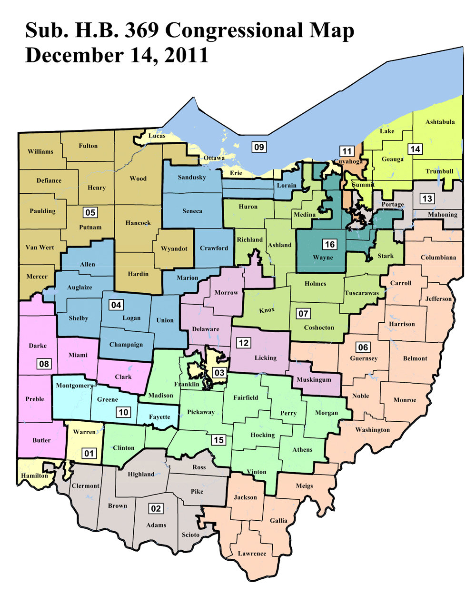
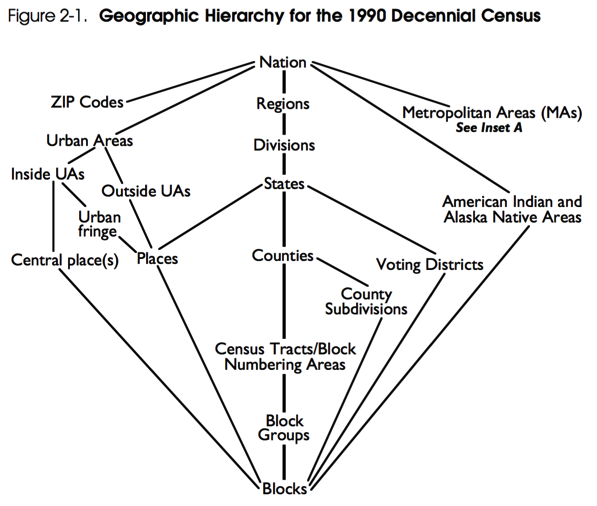

# Geography



### Contents

1.  [Included Data](#tbd)
2.  [Data Sources & Cleaning Scripts](#tbd)
3.  [Extra: Understanding US Census Geographic Entities](#tbd)
4.  [Extra: ANSI/FIPS Codes, GEOID Codes, and District Numbers](#tbd)

## Included Data

#### Embeddable and Reference Maps

Source: Ohio Secretary of State
Available here.

#### Geography Lists

Source: Census
Available here.

#### Block Assignments

Source: Census
Available here.

#### Tract Assignments

Source: Census
Available here.

#### Geography Shapes

Source: Ohio Secretary of State
Available here.

#### Block Precinct Equivalencies

Source: Ohio Secretary of State
Available here.

#### GARM Extracts 

Source: Census
Available here.

<!--
Add?

(blockgroup/tract/vtd geojson/shape? per county)
(county shapefiles/geojson?)
-->

### Extent and format of included data

Stored here are ***only the districts contained (at least partially) within
the reference area of NE Ohio***. In order to find the raw data for the
whole state, investigate the associated sources.

***Note: the data contained here may not be the same as the sourced, raw data!***
I ran all of the source data through an initial *data cleaning* pass in order
to make it more sensible and easier to work with. I have included links to
the sources for all data, and where major cleaning was undertaken
the scripts included and discussed below.

*Still, what cleaning may have been done may be unclear.* Deal. :sunglasses:

## Data Sources & Cleaning Scripts

1.  [Census State Legislative District Reference Maps (Post 2010)][census-maps]
2.  [Ohio Secretary of State 2012-2022 District Maps][oh-secstate]
3.  [Census Geographic Area Reference Manual (GARM)](https://www.census.gov/geo/reference/garm.html)
4.  [Wikipedia American Community Survey definition](https://en.wikipedia.org/wiki/American_Community_Survey)
5.  [American Community Survey](https://www.census.gov/programs-surveys/acs/)
6.  [American FactFinder](http://factfinder.census.gov/faces/nav/jsf/pages/index.xhtml)

Ohio census block maps by county
http://www.census.gov/geo/maps-data/maps/block/2010/county/dc10blk_st39_county.html

#### Initial data cleaning scripts

Example:

```
./bin/convert_to_geojson --help
./bin/convert_to_geojson shape.zip --dest-file ohio-cd-shapes.geojson --description "Ohio Congressional Districts"
```

<!--
More examples:

```
./bin/convert_to_geojson house_shapefile_dir/ --description "Ohio General Assembly House Districts" 
./bin/convert_to_geojson senate_shapefile.zip
```
-->

---

## Extra: Understanding US Census Geographic Entities



- **Census Geographic Area Reference Manual (GARM)**: created in 1990 (and 
  used since), the GARM describes the basic geographic entities the Census 
  Bureau uses.<sup>3</sup>
- **[Census block](https://www.census.gov/geo/reference/webatlas/blocks.html)**: the smallest geographic entity that is used for census 
  purposes. All other geographies should be composed of these, but Ohio's VTDs
  may follow "split-block" geography according to their own shapefiles.
- **[Census block group](https://www.census.gov/geo/reference/webatlas/blockgroups.html)**: a collection of blocks, and the smallest entity for
  which "sample" data is available for the American Communities Survey (ACS).
- **[Voting districts (VTDs)](https://www.census.gov/geo/reference/webatlas/vtds.html)**: a collection of blocks (ideally, but see above)
  that represents a unique voting district for state and federal elections.
  These are not contiguous with Census block groups, however. Also known as a
  "precinct."
- **American Community Survey (ACS)**: an ongiong statistical survey that
  gathers demographic data continuously by statistical sampling, as opposed
  to the decennial's "complete" survey of US households.<sup>4</sup> The ACS
  releases data that is averaged over multiple samplings, on 1-, 3- and 5-
  year timelines; the larger the timeline, the smaller of an entity that is
  supported. *5-year estimates are available for Census block groups, eg*.

<!-- FIPS: https://en.wikipedia.org/wiki/Federal_Information_Processing_Standards -->
<!-- County subdivisions (MCDs/CCDs): -->
<!-- Counties: -->
<!-- [Census tract](https://www.census.gov/geo/reference/webatlas/tracts.html): -->
<!-- PUMAs: entities for which PUMS data is available. -->
<!-- PUMS: publically available data from the ACS for allowed -->
<!-- OHCD vs SLDU & SLDL -->

<!--

~~~

Census Geographic codes (reference this further!)
https://www.census.gov/geo/reference/geocodes.html

County FIPS -- state + county: 39 + 001

Tract name: 1000 (4 numbers, not starting in 0 unless water)
Tract number: XXXX.XX -> XXXXXX = 100000
this tract 9701 is 970100, and tract 23.2 is 002320

Block group: 1-9
Block: group + XXX (3 numbers, 000 to 999), thus BG 1, BK 023 is 1023

Nest them all:

390019701001023 means: OH, Adams County, Tract 9701, Block 10023 (Group 1)

~~~

Census Geocoder: https://www.census.gov/geo/maps-data/data/geocoder.html
(you can batch process!)

Census Relationship Files
https://www.census.gov/geo/maps-data/data/relationship.html

Census tract -> PUMAs    (https://www.census.gov/geo/maps-data/data/centract_puma_rel_layout.html)
SLDLs/Us -> Census tract (https://www.census.gov/geo/maps-data/data/sld_state.html)
CDs -> Census tracts     (https://www.census.gov/geo/maps-data/data/cd_state.html)


VTD lists!!!!
https://www.census.gov/geo/reference/codes/vtd.html


Block assignment files
https://www.census.gov/geo/maps-data/data/baf_description.html
(description) https://www.census.gov/geo/maps-data/data/baf_description.html

Name lookup tables
https://www.census.gov/geo/maps-data/data/nlt.html
(description) https://www.census.gov/geo/maps-data/data/nlt_description.html

---


2010, 2012, 2014 results… (Political???)

http://www.sos.state.oh.us/elections/Research/electResultsMain/2010Results.aspx
http://www.sos.state.oh.us/elections/Research/electResultsMain/2012Results.aspx
http://www.sos.state.oh.us/elections/Research/electResultsMain/2014Results.aspx

2008 results… (Political???)

crazy website about the silent majority

#### Notes

Ohio Secretary of State

> Every 10 years, following the decennial census, Ohio General Assembly 
> and Congressional districts are redrawn to reflect changes in the state's
> population in two parallel, but separate processes. The goal of each 
> is to preserve the important one person-one vote principle – that all 
> citizens are equally represented at the Statehouse and in the United 
> States Capitol.

> *(cough) bullshit (cough)*

Ohio Secretary of State "Readme" for Maps

> Because the Ohio legislative plans were built upon a unique set of geography, it is
> important that the user review the notes that accompany the plan geography provided
> by the Joint Secretaries to the 2011 Apportionment Board.
> 
> The shape file is intended primarily for visual representation of the plan and only
> contains the outlines of the districts. The assignment file is the preferred way to
> load the plan geography into a GIS system for plan review. This is especially so due
> to the split-block geography.
> 
> For accurate population counts and visual representations of the plan at low levels
> of geography, the user must have the geographic data files from the OCURD datasets.

Block Equivalency File. For a plan to be posted, the member must provide to the
Director of Geographic Information Systems (GIS) an electronic block equivalency
file showing the district to which each census block has been assigned. The file
must be either in dBASE format, such as an export file produced by Maptitude for
Redistricting or Autobound, or in ASCII text format. 


a list of "block-precincts" and their assigned / equivalent district…

Ex.

<BLOCKGEOID><VTDID>, DISTRICT

https://www.arcgis.com/home/item.html?id=5c1449de4d2b43658afc0937111de7da#overview

The district maps represents the results of the 2012-2022 apportionment plan
for the State of Ohio. The shapefiles were obtained from the Ohio Secretary of
State's Office website. Detailed information regarding the development of
these shapefiles can be found at:

http://www.sos.state.oh.us/SOS/reshape/GADistricts/adoptedMap.aspx

Part A. General Overview

1.  To assist users in their review of the legislative district plan, the
    plan geography is being provided in different formats. These include a
    geographic data file known as a shape file and a tabular data file known as an
    assignment file. The geographic file includes the boundaries for each
    district. The tabular data file includes one record for the lowest level of
    geography used to create the plan and the district to which it is assigned.
2.  Users with Geographic Information Systems (GIS) software may note a
    handful of instances in which the appearance of the geography assigned to each
    district may not match the legal boundaries. Notes follow on these instances
    below.
3.  As a general caveat, whatever the geographic representation might appear
    to be when the legislative plan is viewed via any software, the controlling
    document as to the status of any geography is the legal definitions as
    submitted by the Joint Secretaries to the Ohio Apportionment Board. Those
    definitions can be found in this document.
4.  Any geographic area of the state not specifically named in this legal
    definition for House and Senate Districts that is wholly contained within the
    boundaries of a district but not contiguous to any district boundary, is
    assigned to that district. Any geographic area of the state not specifically
    named in this legal definition that is contiguous to any district boundary is
    assigned to that district with which it has the longest continuous boundary.
    If two or more boundaries are of equal length, the area is assigned to the
    district with less population. All districts are contiguous including those
    that are contiguous only by bodies of water.
5.  The legal definition will be posted at the following website designated by the
    Ohio Apportionment Board: http://www.reshapeohio.org. [link not valid as of 2/13/2015]

Part B. Geographic Database

The underlying geographic database used to create plans for legislative
districts was developed by the **Urban Center at Cleveland State University
(CSU)** in conjunction with the **Voinovich Center at Ohio University (OU)**
as part of the project to develop the ***2010 Ohio Common and Unified
Redistricting Database (OCURD)***. CSU was selected by bipartisan action by
the co-chairs of the **Ohio Legislative Task Force on Redistricting,
Reapportionment and Demographic Research**.

The lowest level of geography in this database is not the census block but the
split census block.

1.  The overall purpose of the project was to accommodate for the fact that
    many census blocks contain portions of multiple higher levels of geography,
    such as a precinct or a municipality. In geographic terms, these are known as
    'split' units because they did not nest into the higher levels of geography.
    The project also enabled the creation of geographic layers for wards (which
    were not part of the census geographic products) and precincts that more
    closely reflect the boundaries used in the 2008 and 2010 elections.
2.  To create a geographic system that allowed for topological integrity, the
    OCURD project used the boundaries of the higher levels of geography as
    overlays and assigned the underlying census block, or portions thereof, to
    each of the higher levels. When the higher level geography crossed the census
    block, a new geographic unit was created known as a split block. It is this
    'block split' layer of geography that was the lowest level of geography from
    which the legislative districts were created.
3.  Another goal of the OCURD project was to estimate the population in each
    portion of the split blocks. The project researched several means by which
    this could be accomplished and chose a method based upon the length of the
    streets in each such block. Because the population was estimated for each
    portion, the number of persons was not rounded to a whole person and thus some
    fractional numbers will be found.
4.  Another issue arose as the OCURD database was being used by the Joint
    Secretaries of the Ohio Apportionment Board to create legislative plans. This
    issue relates to the fact that many of the higher levels of geography, notably
    municipalities, wards, and precincts, contain multiple pieces of territory
    that are separated by distances short and long. In geographic terms, these are
    known as 'non-contiguous areas' (NCA) because there is some other land or
    water between the pieces. There are two types of NCAs: those that are not
    contiguous because they are islands surrounded by water and those that are not
    contiguous because they are legally or technically a portion of a geographic
    unit but surrounded by other land-based geographic units. Examples of the
    first type are the islands off the coast of Lake Erie. Examples of the second
    type abound in the state.
5.  In most cases, the multi-part units are combined for geographic
    representation in GIS software. In geographic terms, these are known as
    'shapes' and are assigned to a district as one unit, even though there may be
    separate estimates of population for the blocks that comprise the higher level
    unit. Because they are combined as an entire shape they can only be assigned
    to one district by the GIS software used for the redistricting phase of the
    apportionment process. The software used by the Board to undertake this
    process was Maptitude for Redistricting (MTR) by Caliper Corporation.
6.  Requirements of the Ohio Constitution relate to both creating districts
    from contiguous territory and the maintenance of political subdivision
    boundaries. Therefore, making use of a multi-part area as the boundary of a
    district could present a situation in which a political subdivision would be
    split and a district would be created using non- contiguous territory.
7.  Whatever the geographic representation of the GIS software, the
    controlling document as to the status of any geography is the legal definition
    as adopted by the Apportionment Board.
8.  Because some areas in the higher geographic levels are multi-part units
    the software flagged some districts as being non-contiguous. **Notes on these
    situations follow**.

Part C. Notes on Specific Districts:

The following areas include
districts that were designated by the Maptitude software as having some non-
contiguous areas:

1.   District 38—Stark County. Block 391517147013085 is
split into two pieces including portions of precincts 151ANY & 151AEB. The
portion in 151ANY contains no population and is a part of district 49. See the
item 4 in Part A and the legal definition.

2.   District 46—Lucas County.
Several islands are located off the Lake Erie coast but are portions of
Jerusalem Township. See the item 4 in Part A and the legal definition.

3.
District 48—Stark County. Block 391517123002009 is split into three pieces
including portions of precincts 151ACD, 151AME, and 151ANG. Each of these
portions contains no population. The triangular portion at the lower south
east of the block is a part of district 49. See the item 4 in Part A and the
legal definition.

4.   District 55—Lorain County. Several islands are located
off the Lake Erie coast but are portions of Avon Lake City. See the item 4 in
Part A and the legal definition.

5.   District 83—Hardin and Logan Counties.
There is one unit in the 'Block Split' layer, 390650007003086091AAR, that is
unassigned in the map. It contains no population and is surrounded by district
83. See the item 4 in Part A and the legal description.

6.   District
88—Sandusky County. One island is located in Sandusky Bay but is a portion of
Riley Township. See the item 4 in Part A and the legal definition.

7.
District 89—Ottawa County. This district has three components: the portion
above Sandusky Bay; the portion below Sandusky Bay; and several islands off
the Lake Erie coast. See the item 4 in Part A and the legal definition.

-->

## Extra: [ANSI/FIPS][fips] Codes, [GEOID][geoid] Codes, and District Numbers

#### The State of Ohio (OH) FIPS Code

***`39`***

#### Counties FIPS Codes in NE Ohio

| County     | FIPS code  |
|------------|------------|
| Ashland    | 039***005*** |
| Ashtabula  | 039***007*** |
| Carroll    | 039***019*** |
| Columbiana | 039***029*** |
| Cuyahoga   | 039***035*** |
| Geauga     | 039***055*** |
| Lake       | 039***085*** |
| Lorain     | 039***093*** |
| Mahoning   | 039***099*** |
| Medina     | 039***103*** |
| Portage    | 039***133*** |
| Richland   | 039***139*** |
| Stark      | 039***151*** |
| Summit     | 039***153*** |
| Trumbull   | 039***155*** |
| Wayne      | 039***169*** |

[To see the FIPS codes for every county, see Wikipedia.][fips-oh-wiki]

#### State General Assembly Districts (SLDLs & SLDUs) in NE Ohio

> The identifiers ***SLDL*** and ***SLDU*** stand for 
> *State Legislative District, Lower* (the House) and
> *State Legislative District, Upper* (the Senate).

| House | Senate | Counties |
|-------|--------|----------|
|  01   |   27   | Wayne    |
|  02   |   22*  | Richland |
|  05   |   33   | Columbiana |
|  06   |   24   | Cuyahoga |
|  07   |   24   | Cuyahoga |
|  08   |   25   | Cuyahoga |
|  09   |   21   | Cuyahoga |
|  10   |   21   | Cuyahoga |
|  11   |   21   | Cuyahoga |
|  12   |   25   | Cuyahoga |
|  13   |   23   | Cuyahoga |
|  14   |   23   | Cuyahoga |
|  15   |   23   | Cuyahoga |
|  16   |   24   | Cuyahoga |
|  34   |   28   | Summit   |
|  35   |   28   | Summit   |
|  36   |   28   | Summit   |
|  37   |   27   | Summit   |
|  38   |   27   | Summit, Stark |
|  48   |   29   | Stark    |
|  49   |   29   | Stark    |
|  50   |   29   | Stark    |
|  55   |   13   | Lorain   |
|  56   |   13   | Lorain   |
|  57   |   13   | Huron, Lorain |
|  58   |   33   | Mahoning |
|  59   |   33   | Mahoning |
|  60   |   25   | Lake     |
|  61   |   18   | Lake     |
|  63   |   32   | Trumbull |
|  64   |   32   | Trumbull, Ashtabula |
|  69   |   22*  | Medina   |
|  70*  |   22*  | Ashland, Medina, *Holmes* |
|  75   |   18   | Portage  |
|  76   |   18   | Geauga, Portage |
|  95*  |   30*  | Carroll, *Harrison*, *Belmont*, *Noble*, *Washington* |
|  99   |   32   | Ashtabula, Geauga |

<!-- 
**OH Senate (SLDUs)**: 0013, 0018, 0021, 0022*, 0023, 0024, 0025, 0027, 
0028, 0029, 0030*, 0032, 0033 (13)

**OH House (SLDLs)**: 0001, 0002, 0005, 0006, 0007, 0008, 0009, 0010, 
0011, 0012, 0013, 0014, 0015, 0016, 0034, 0035, 0036, 0037, 0038, 
0048, 0049, 0050, 0055, 0056, 0057, 0058, 0059, 0060, 0061, 0063,
0064, 0069, 0070*, 0075, 0076, 0095*, 0099 (7)
-->

#### Congressional Districts (CDs) in NE Ohio

| District |     Counties     |
|----------|------------------|
|    04*   | Lorain           |
|    06*   | Mahoning, Columbiana, Carroll |
|    07*   | Lorain, Medina, Richland, Ashland, Stark |
|    09*   | Lorain, Cuyahoga |
|    11    | Cuyahoga, Summit |
|    12*   | Richland         |
|    13    | Summit, Portage, Trumbull, Mahoning |
|    14    | Cuyahoga, Summit, Lake, Geauga, Portage, Ashtabula, Trumbull |
|    16    | Cuyahoga, Medina, Summit, Wayne, Stark, Portage |

* — SLDLs 70 & 95, their SLDUs, and CDs 4, 6, 7, 9 & 12, are only 
  *partly* in NEOH.

<!-- LINKS -->

[census-maps]: http://www.census.gov/geo/maps-data/maps/reference-sld.html
[oh-secstate]: http://www.sos.state.oh.us/elections/candidates/district%20maps.aspx

[geoid]: https://www.census.gov/geo/reference/geoidentifiers.html
[fips]:  https://www.census.gov/geo/reference/ansi.html

[fips-oh-wiki]: https://en.wikipedia.org/wiki/List_of_counties_in_Ohio
