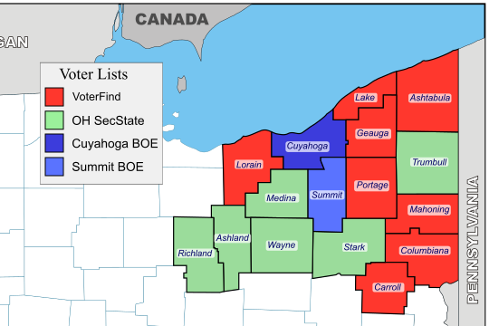

# Ohio Voter Lists

### Contents

1. **[NEOH Data File Formats and Counties](#northeast-ohio-neoh-mixed-format-data-files)**
2. **[Master Ohio Voter List Data Scraper](#ohio-voter-list-data-scraper)**
3. **[Master Fields List](#master-fields-list)**

---

## Northeast Ohio (NEOH) Mixed Format Data Files



### File Formats and Counties

- **[VoterFind](#voterfind-files)**: Ashtabula, Carroll, Columbiana, 
  Geauga, Lake, Lorain, Mahoning, Portage
- **[Secretary of State (Raw)](#secretary-of-state-raw-files)**: 
  Ashland, Medina, Richland, Stark, Trumbull, Wayne
- **Summit County**: Summit
- **Cuyahoga County, by Subdivision**: Cuyahoga

#### VoterFind Files

From each county's Board of Elections website, via 
[ElectionsOnThe.net][eleconnet]

This seems to be a custom-built service for Ohio counties, which some
use and some do not. Those that do not also seem to use [ESS][ess]
integrated software and hardware solutions, including the
[VoterView application][voterview], which does not print lists, and so
they are represented below by the raw files from the Secretary of State.

These files are organized for walking, street-by-street.

#### Secretary of State (Raw) Files

From [the Ohio Secretary of State's website][secstate]:

> Last Updated
> June 28, 2016
>
> This document contains a description of the Voter Registration Data 
> Files that are available on the Ohio Secretary of State’s Election 
> Division’s FTP site. These files are downloaded from the current 
> Centralized Ohio Voter Registration Database. The database is a 
> record collection of registered voters in the state of Ohio, as 
> submitted by each county Board of Elections. These records are 
> submitted and maintained in accordance with the Ohio Revised Code.
>
> Current files include voting histories for elections from year 2000 
> as provided by the counties. 
>
> There is one record for every active voter registration.

### Summit County Board of Elections

… TBD

#### Cuyahoga County Board of Elections, by Subdivision

http://boe.cuyahogacounty.us/en-US/citydownloads.aspx

… TBD

## Ohio Voter List Data Scraper

How to scrape/download the lists:

```
$ ./scraper/bin/scrape_voter_lists
```

## Master Fields List

While each field may be named or structured differently, they all 
generally conform to this list. Some have fewer fields than others, and
in each format the fields are named and ordered differently.

|         Field Name        | Width | Description |
|---------------------------|-------|-------------|
| SOS Voter Id                |  13 | Secretary of State centralized system’s unique number for each *voter registration record.* |
| County Number               |   2 | Number that identifies each of Ohio’s 88 Counties (01-88). |
| County Id                   |  50 | County’s unique number for each *voter registration record.*  |
| Last Name                   |  50 | Voter’s last name. |
| First Name                  |  50 | Voter’s first name. |
| Middle Name                 |  50 | Voter’s middle name. |
| Suffix                      |  10 | Voter’s name suffix.  |
| Date Of Birth               |  10 | Voter’s Date of Birth in YYYY-MM-DD format. |
| Registration Date           |  10 | Date voter registered in YYYY-MM-DD format. |
| Voter Status                |  20 | ACTIVE, CONFIRMATION |
| Party Affiliation           |   1 | Party affiliation code* for last recorded Primary Election. |
| Residential Address1        | 100 | Voter’s street address. |
| Residential Address 2       | 100 | " |
| Residential City            |  50 | " |
| Residential State           |  20 | " |
| Residential Zip             |   5 | " |
| Residential Zip Plus 4      |   4 | " |
| Residential Country         |  50 | " |
| Residential Postal Code     |  10 | " |
| Mailing Address1            | 100 | Voter’s mailing address. |
| Mailing Address 2           |  10 | " |
| Mailing City                |  50 | " |
| Mailing State               |  20 | " |
| Mailing Zip                 |   5 | " |
| Mailing Zip Plus 4          |   4 | " |
| Mailing Country             |  50 | " |
| Mailing Postal Code         |  10 | " |
| Career Center               |  80 | Name of Career Center |
| City                        |  80 | Name of City |
| City School Dist.           |  80 | Name of City School Dist. |
| County Court Dist.          |  80 | Name of County Court |
| Congressional Dist.         |   2 | Congressional Dist. identifier |
| Court of Appeals            |   2 | Court of Appeals identifier |
| Education Service Center    |  80 | Name of Education Service Center |
| Exmptd Village School Dist. |  80 | Name of Exempt School Dist. |
| Library Dist.               |  80 | Name of Library Dist. |
| Local School Dist.          |  80 | Name of Local School Dist. |
| Municipal Court Dist.       |  80 | Name of Municipal Court Dist. |
| Precinct                    |  80 | Name of Precinct |
| Precinct Code               |  20 | Code assigned to the Precinct |
| State Board of Education    |   2 | State Board of Education identifier |
| State Representative Dist.  |   2 | House Dist. identifier |
| State Senate Dist.          |   2 | State Senate Dist. identifier |
| Township                    |  20 | Name of Township |
| Village                     |  20 | Name of Village |
| Ward                        |  20 | Name of Ward |
| Elections list (many fields) | 50 | Party affiliation code* for given election. |

> ___* — Party affiliation codes are:___
> 
> - _C: Constitution Party_
> - _D: Democrat Party_
> - _E: Reform Party_
> - _G: Green Party_
> - _L: Libertarian Party_
> - _N: Natural Law Party_
> - _R: Republican Party_
> - _S: Socialist Party_
> - _X: Voted without declaring party affiliation_
> - _Blank: Indicates that there is no voting record for this voter for 
>   this election._

<!-- LINKS -->

[secstate]:  http://www6.sos.state.oh.us/ords/f?p=111:1
[voterfind]: http://www.voterfind.com/Lorainoh/vtrreport.aspx
[eleconnet]: http://electionsonthe.net/
[ess]:       https://en.wikipedia.org/wiki/Election_Systems_%26_Software
[voterview]: https://trumbull.oh-vote.org/VoterView/Home.do
